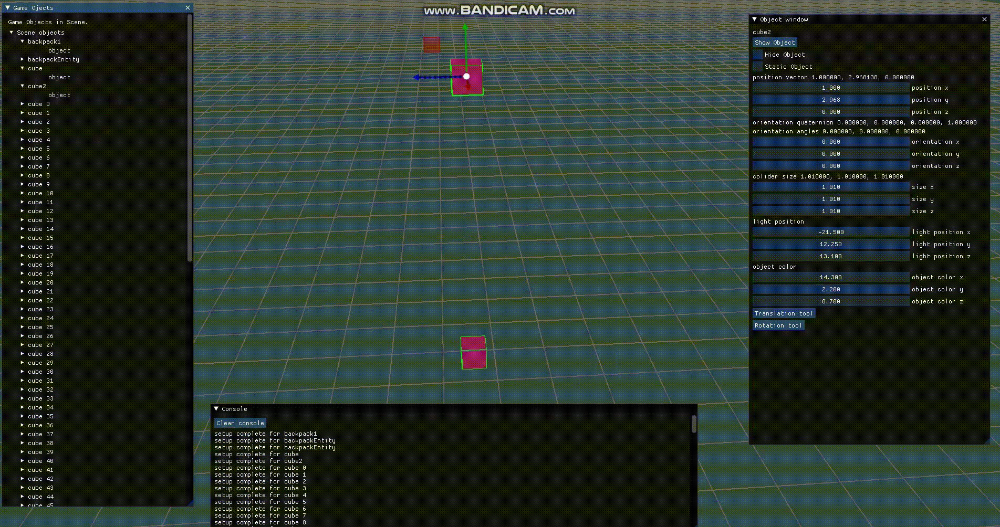

## Some game engine

### Current result():

### Some Editor Example:

### Some Game Made Inside an Engine
#

### There is a lot of functional by now:
- [X] 3D/2D modes, some editor
- [X] Models loading
- [X] Some shaders for lighting, bloom, blur, shadows, editor picking
- [X] Some Rednerer Pipeline foundation
- [X] Particle system (40000 particles on my machine)
- [X] Sprite Animations, Skeletal Animations
- [X] Entity Component System (we trying not to use virtual functions for it(But it wastes a lot of space, but its better than jumping to virtuall function every frame for every object. Although we didnt benchmark it. Maybe CPU will optimize one of approaches better than another, will see{))
- [X] Our custom rigidbody physics(probably well have to utilise physX or bullet)
- [X] Custom collider detection(GJK and stuff)
- [X] Aility to write scripts in c++, and load scripts as a library into editor project
- [X] Scene serialization and prefab system
- [X] Editor (Clicking and Picking, Guizmos for tranlation, rotation, scale; Scene Graph, Object component manipualtion, etc)
